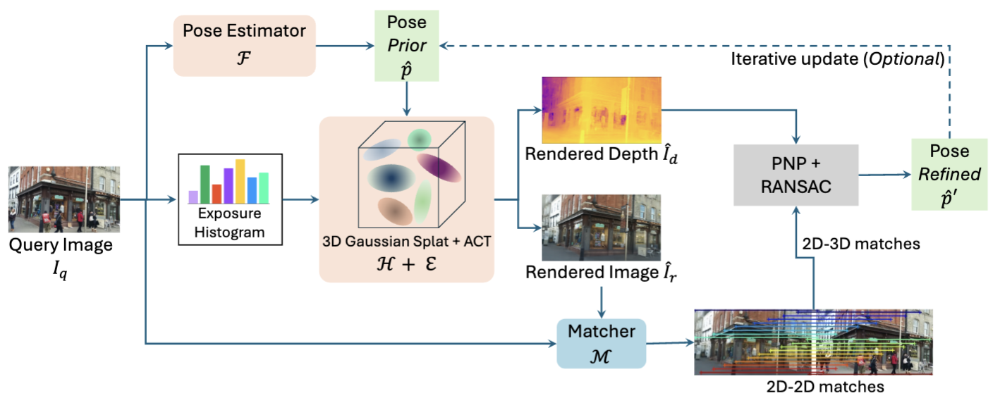








I'm a PhD candidate in Computer Science and Engineering at the [Hong Kong University of Science and Technology](https://hkust.edu.hk/), supervised by Prof. [Tristan Braud](https://braudt.people.ust.hk/index.html). I am fortunate to visit the [Active Vision Laboratory](https://www.robots.ox.ac.uk/~lav/), [University of Oxford](https://www.ox.ac.uk/) advised by Prof. [Victor Prisacariu](https://www.robots.ox.ac.uk/~victor/). I received my bachelor's degree from [Shanghai Jiao Tong University](https://en.sjtu.edu.cn/). Research Focus: Improve the user's Augmented Reality (AR) and Virtual Reality (VR) experience and explore the application of AR and VR technology in visualization.

# 🔥 News
- *2024.04*: &nbsp;🎉🎉 Start visiting in [the Active Vision Laboratory](https://www.robots.ox.ac.uk/~lav/), [University of Oxford](https://www.ox.ac.uk/)! Thanks [Shuai Chen](https://chenusc11.github.io/) for showing me around the University and Lab!
- *2024.02*: &nbsp;🎉🎉 One paper is accepted in Conference on Computer Vision and Pattern Recognition (CVPR) 2024. Thanks to all coauthors!
- *2024.01*: &nbsp;🎉🎉 One paper is accepted in  International Conference on Robotics and Automation (ICRA) 2024. Thanks to all coauthors!

# 📝 Publications and Preprints
\* equal contribution

arXiv

[GSLoc: Efficient Camera Pose Refinement via 3D Gaussian Splatting](https://arxiv.org/abs/2408.11085)

**Changkun Liu**, Shuai Chen, Yash Bhalgat, Siyan Hu, Zirui Wang, Ming Cheng, Victor Adrian Prisacariu, Tristan Braud. (arXiv)

CVPR 2024

[360Loc: A Dataset and Benchmark for Omnidirectional Visual Localization with
Cross-device Queries](https://arxiv.org/pdf/2311.17389.pdf)

Huajian Huang\*, **Changkun Liu\***, Yipeng Zhu, Hui Cheng, Tristan Braud, and Sai-Kit Yeung (CVPR 2024)

[**Project**](https://huajianup.github.io/research/360Loc/) <strong></strong>
- 360Loc is the first dataset and benchmark that explores the challenge of cross-device visual positioning, involving 360° reference frames, and query frames from pinhole, ultra-wide FoV fisheye, and 360° cameras. 

ICRA 2024

[HR-APR: APR-agnostic Framework with Uncertainty Estimation and Hierarchical Refinement for Camera Relocalisation](https://arxiv.org/abs/2402.14371)

**Changkun Liu**, Shuai Chen, Yukun Zhao, Huajian Huang, Victor Prisacariu, and Tristan Braud (ICRA 2024)

[**Project**](https://lck666666.github.io/research/HR-APR/index.html) <strong></strong>
- This work introduces a novel APR-agnostic framework, HR-APR, that formulates uncertainty estimation as cosine similarity estimation between the query and database features. 

- [MARViN: Mobile AR Dataset with Visual-Inertial Data](https://lck666666.github.io/research/MARViN/index.html), **Changkun Liu\***, Yukun Zhao\*, Tristan Braud. **IEEE VR 2024 Workshop**

- [MobileARLoc: On-device Robust Absolute Localisation for Pervasive Markerless Mobile AR](https://arxiv.org/abs/2401.11511), **Changkun Liu\***, Yukun Zhao\*, Tristan Braud. **PerCom 2024 Workshop**

- [VR PreM+: An Immersive Pre-learning Branching Visualization System for Museum Tours](https://dl.acm.org/doi/abs/10.1145/3629606.3629643), Ze Gao, Xiang Li, **Changkun Liu**, Xian Wang, Anqi Wang, Liang Yang, Yuyang Wang, Pan Hui, Tristan Braud. **Chinese CHI 2023**

- [AIR-HLoc: Adaptive Image Retrieval for Efficient Visual Localisation](https://arxiv.org/abs/2403.18281), **Changkun Liu**, Huajian Huang, Zhengyang Ma, Tristan Braud. **arXiv**

# 📖 Educations
- *2021.09 - now*, Ph.D. in Computer Science and Engineering, The Hong Kong University of Science and Technology.
- *2017.09 - 2021.06*, Bachelor of Engineering in Electronic Science and Technology, Shanghai Jiao Tong University. 

# 💻 Experience
- *2024.04 - now*, Visiting Research Student at the University of Oxford, Oxford, UK.
- *2020.06 - 2021.05*, Intel Asia-Pacific R&D Ltd., Shanghai, China.
- *2019.07 - 2019.08*, University of Washington, Seattle, US.

# 🎖 Honors and Awards
- *2024* Overseas Research Award in HKUST
- *2021-now* Postgraduate Studentship in HKUST
- *2021* Outstanding Graduate of Shanghai Jiao Tong University (Top 20%)
- *2020* Second-Class Scholarship Awarded by SCSK, Kabuskiki Kaisha (Top 4%)
- *2020* Class B Scholarship of SJTU
- *2018, 2019* Class C Scholarship of SJTU
