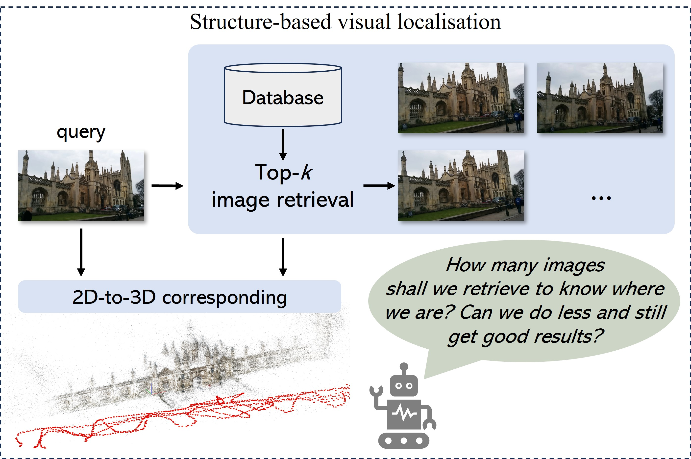








I'm a PhD candidate in Computer Science and Engineering at the [Hong Kong University of Science and Technology](https://hkust.edu.hk/), supervised by Prof. [Tristan Braud](https://braudt.people.ust.hk/index.html). I was fortunate to visit the [Active Vision Laboratory](https://www.robots.ox.ac.uk/~lav/), [University of Oxford](https://www.ox.ac.uk/) advised by Prof. [Victor Prisacariu](https://www.robots.ox.ac.uk/~victor/). I previously worked as a research intern at [Ant Research](https://www.antresearch.com/LaboratoryDetails/Intelligent_Interaction_Lab-detail), working with Dr.[Nan Xue](https://xuenan.net/) and Dr.[Bin Tan](https://icetttb.github.io/). I received my bachelor's degree from [Shanghai Jiao Tong University](https://en.sjtu.edu.cn/). Research Focus: Visual Localization, 3D Reconstruction, and 3D vision foundation models.

**I am currently seeking both academic and industry opportunities for 2025-2026. Feel free to reach out via email!!**

# 🔥 News
- *2025.01*: &nbsp;🎉🎉 Two papers are accepted to International Conference on Robotics and Automation (ICRA) 2025. Thanks to all coauthors!
- *2025.01*: &nbsp;🎉🎉 One paper is accepted to International Conference on Learning Representations (ICLR) 2025. Thanks to all coauthors!
- *2024.04*: &nbsp;🎉🎉 Start visiting in [the Active Vision Laboratory](https://www.robots.ox.ac.uk/~lav/), [University of Oxford](https://www.ox.ac.uk/)! Thanks [Shuai Chen](https://chenusc11.github.io/) for showing me around the University and Lab!
- *2024.02*: &nbsp;🎉🎉 One paper is accepted to Conference on Computer Vision and Pattern Recognition (CVPR) 2024. Thanks to all coauthors!
- *2024.01*: &nbsp;🎉🎉 One paper is accepted to  International Conference on Robotics and Automation (ICRA) 2024. Thanks to all coauthors!

# 📝 Publications and Preprints
\* equal contribution

ICLR 2025

[GS-CPR: Efficient Camera Pose Refinement via 3D Gaussian Splatting](https://openreview.net/forum?id=mP7uV59iJM)

**Changkun Liu**, Shuai Chen, Yash Bhalgat, Siyan Hu, Ming Cheng, Zirui Wang, Victor Adrian Prisacariu, Tristan Braud. (**ICLR 2025**)

[**[Project]**](https://xrim-lab.github.io/GS-CPR/)  [**[Code]**](https://github.com/XRIM-Lab/GS-CPR) <strong></strong>
- GS-CPR is a camera pose refinement framework that leverages 3D Gaussian Splatting for scene representation, combined with the 3D foundation model, MASt3R.

ICRA 2025

[LiteVLoc: Map-Lite Visual Localization for Image Goal Navigation](https://arxiv.org/abs/2410.04419)

Jianhao Jiao, Jinhao He, **Changkun Liu**, Sebastian Aegidius, Xiangcheng Hu, Tristan Braud, Dimitrios Kanoulas. (**ICRA 2025**)

[**[Project]**](https://rpl-cs-ucl.github.io/LiteVLoc)  [**[Code]**](https://github.com/RPL-CS-UCL/litevloc_code)<strong></strong>
- This paper introduces LiteVLoc, a hierarchical visual localization framework using lightweight topometric maps for efficient, precise camera pose estimation, validated through experiments in simulated and real-world scenarios.

ICRA 2025

[AIR-HLoc: Adaptive Retrieved Images Selection for Efficient Visual Localisation](https://arxiv.org/abs/2403.18281)

**Changkun Liu**,  Jianhao Jiao, Huajian Huang, Zhengyang Ma, Dimitrios Kanoulas, Tristan Braud. (**ICRA 2025**)

[**Paper**](https://arxiv.org/abs/2403.18281) <strong></strong>
- We propose an adaptive strategy that adjusts k based on the similarity between the query's global descriptor and those in the database, effectively mitigating the feature-matching bottleneck in hierarchical localisation pipelines.

CVPR 2024

[360Loc: A Dataset and Benchmark for Omnidirectional Visual Localization with
Cross-device Queries](https://arxiv.org/pdf/2311.17389.pdf)

Huajian Huang\*, **Changkun Liu\***, Yipeng Zhu, Hui Cheng, Tristan Braud, and Sai-Kit Yeung (**CVPR 2024**)

[**[Project]**](https://huajianup.github.io/research/360Loc/) [**[Dataset]**](https://github.com/HuajianUP/360Loc)<strong></strong>
- 360Loc is the first dataset and benchmark that explores the challenge of cross-device visual positioning, involving 360° reference frames, and query frames from pinhole, ultra-wide FoV fisheye, and 360° cameras. 

ICRA 2024

[HR-APR: APR-agnostic Framework with Uncertainty Estimation and Hierarchical Refinement for Camera Relocalisation](https://arxiv.org/abs/2402.14371)

**Changkun Liu**, Shuai Chen, Yukun Zhao, Huajian Huang, Victor Prisacariu, and Tristan Braud (**ICRA 2024**)

[**Project**](https://lck666666.github.io/research/HR-APR/index.html) <strong></strong>
- This work introduces a novel APR-agnostic framework, HR-APR, that formulates uncertainty estimation as cosine similarity estimation between the query and database features. 

- [MARViN: Mobile AR Dataset with Visual-Inertial Data](https://lck666666.github.io/research/MARViN/index.html), **Changkun Liu\***, Yukun Zhao\*, Tristan Braud. **IEEE VR 2024 Workshop**

- [MobileARLoc: On-device Robust Absolute Localisation for Pervasive Markerless Mobile AR](https://arxiv.org/abs/2401.11511), **Changkun Liu\***, Yukun Zhao\*, Tristan Braud. **PerCom 2024 Workshop**

- [VR PreM+: An Immersive Pre-learning Branching Visualization System for Museum Tours](https://dl.acm.org/doi/abs/10.1145/3629606.3629643), Ze Gao, Xiang Li, **Changkun Liu**, Xian Wang, Anqi Wang, Liang Yang, Yuyang Wang, Pan Hui, Tristan Braud. **Chinese CHI 2023**

# 📖 Educations
- *2021.09 - now*, Ph.D. in Computer Science and Engineering, The Hong Kong University of Science and Technology.
- *2017.09 - 2021.06*, Bachelor of Engineering in Electronic Science and Technology, Shanghai Jiao Tong University. 

# 💻 Experience
- *2025.01 - now*, Research Intern, Ant Research, Ant Group.
- *2024.04 - 2024.08*, Visiting Research Student at the University of Oxford, Oxford, UK.
- *2020.06 - 2021.05*, Intel Asia-Pacific R&D Ltd., Shanghai, China.
- *2019.07 - 2019.08*, University of Washington, Seattle, US.

# 🎖 Honors and Awards
- *2024* Overseas Research Award in HKUST
- *2021-now* Postgraduate Studentship in HKUST
- *2021* Outstanding Graduate of Shanghai Jiao Tong University (Top 20%)
- *2020* Second-Class Scholarship Awarded by SCSK, Kabuskiki Kaisha in SJTU (Top 4%)
- *2020* Class B Scholarship of SJTU
- *2018, 2019* Class C Scholarship of SJTU

# Academic Service
- Reviewer: IROS, ICRA, ICLR

<html lang="zh">
<head>
    <meta charset="UTF-8">
    <meta name="viewport" content="width=device-width, initial-scale=1.0">
    <title>ClustrMaps Globe</title>
    
</head>
<body>

    

        
    

</body>
</html>